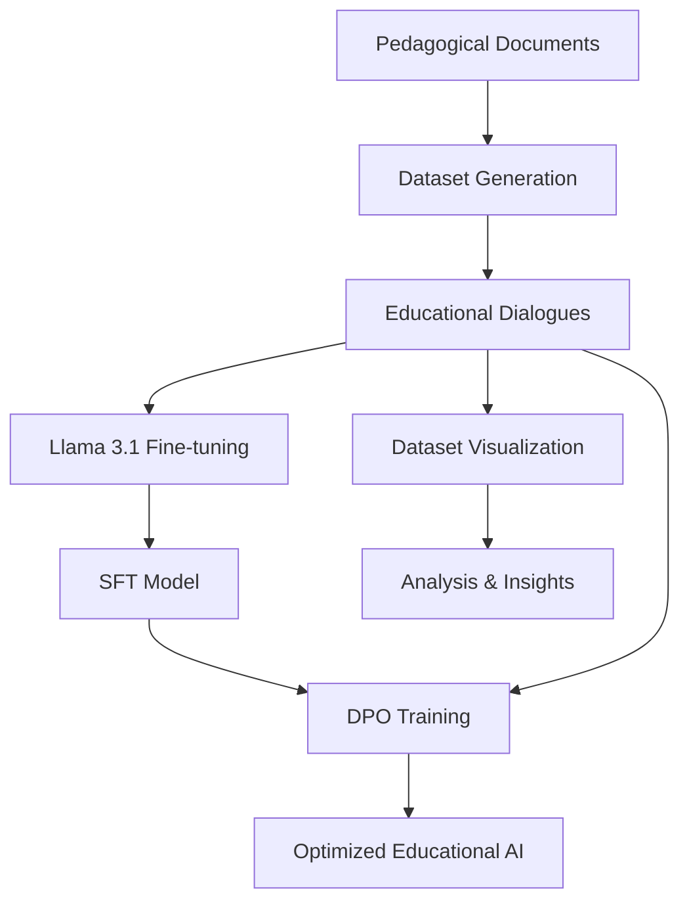

<p align="center">
    
</p>
<p align="center"><h1 align="center"><code>❯ NLP DPO Fine-tuning for Educational AI</code></h1></p>
<p align="center">
	<em>A comprehensive pipeline for generating educational dialogues, fine-tuning Llama 3.1 models, and implementing Direct Preference Optimization for Assessment for Learning applications.</em>
</p>
<p align="center">
	<!-- Shields.io badges disabled, using skill icons. --></p>
<p align="center">Built with the tools and technologies:</p>
<p align="center">
	<a href="https://skillicons.dev">
		
	</a></p>
<br>

## 🔗 Table of Contents

- [📍 Overview](#-overview)
- [🏗️ Project Architecture](#️-project-architecture)
- [📁 Project Structure](#-project-structure)
- [🚀 Getting Started](#-getting-started)
  - [☑️ Prerequisites](#️-prerequisites)
  - [⚙️ Installation](#️-installation)
  - [🤖 Usage](#-usage)
- [📊 Components Overview](#-components-overview)
  - [Dataset Generation](#dataset-generation)
  - [Dataset Visualization](#dataset-visualization)
  - [Llama 3.1 Fine-tuning](#llama-31-fine-tuning)
  - [Direct Preference Optimization](#direct-preference-optimization)
- [📌 Project Roadmap](#-project-roadmap)
- [🔰 Contributing](#-contributing)
- [🎗 License](#-license)
- [🙌 Acknowledgments](#-acknowledgments)

---

## 📍 Overview

This project presents a complete end-to-end pipeline for creating educational AI systems using state-of-the-art language model fine-tuning techniques. The system focuses on **Assessment for Learning (AfL)** applications and implements advanced training methodologies including **Supervised Fine-Tuning (SFT)** and **Direct Preference Optimization (DPO)**.

### 🎯 Key Objectives

- **Educational Dataset Generation**: Automatically generate high-quality educational dialogues from pedagogical documents
- **Model Specialization**: Fine-tune Llama 3.1 models specifically for educational contexts
- **Preference Learning**: Implement DPO to align model outputs with human educational preferences  
- **Interactive Visualization**: Provide tools for dataset exploration and analysis
- **Scalable Training**: Support for distributed training on HPC clusters

### 🔬 Research Focus

The project addresses the challenge of creating AI systems that can effectively support Assessment for Learning by:
- Processing pedagogical literature to extract educational knowledge
- Generating contextually appropriate educational dialogues
- Training models to provide helpful, accurate educational responses
- Optimizing model behavior through preference learning

---

## 🏗️ Project Architecture



The pipeline consists of four main components that work together to create a comprehensive educational AI system:

1. **Dataset Generation**: Extracts and processes educational content to create dialogue datasets
2. **Visualization**: Provides interactive tools for exploring and validating generated data
3. **SFT Training**: Fine-tunes base Llama 3.1 models on educational conversations
4. **DPO Training**: Further optimizes models using preference learning techniques

---

## 📁 Project Structure

```sh
└── NLP_DPO-Finetuning/
    ├── dataset_generation/           # Educational dataset creation pipeline
    │   ├── core/                    # Core components and processing logic
    │   ├── data/                    # Generated datasets and raw documents
    │   ├── prompts/                 # Templates for dialogue generation
    │   └── create_script.py         # Main dataset generation script
    ├── dataset_visualization/        # Interactive web interface for data exploration
    │   ├── templates/               # HTML templates for visualization
    │   ├── static/                  # CSS and JavaScript assets
    │   ├── run.py                   # Flask web application
    │   └── Dockerfile               # Container configuration
    ├── llama3.1_finetuning/        # Supervised fine-tuning implementation
    │   ├── dataset_preparation/     # Data preprocessing and conversion
    │   ├── training_files/          # Training scripts and configurations
    │   ├── finetuning_notebook.ipynb # Interactive training notebook
    │   └── test.ipynb              # Dataset validation and testing
    ├── llama3.1_dpo/               # Direct Preference Optimization training
    │   ├── core/                    # DPO-specific components
    │   ├── slurm_jobs/              # Generated SLURM job files
    │   ├── dpo_finetuning.py       # Main DPO training script
    │   ├── inference.py             # Interactive chatbot interface
    │   └── utils.py                 # Data processing utilities
    ├── start_data_vis.sh            # Convenience script for visualization app
    └── README.md                    # This comprehensive overview
```

---

## 🚀 Getting Started

### ☑️ Prerequisites

**System Requirements:**
- **Operating System:** Linux (Ubuntu 20.04+ recommended)
- **Programming Language:** Python 3.8+
- **Hardware:** NVIDIA GPU with CUDA support (for training)
- **Memory:** 16GB+ RAM recommended
- **Storage:** 50GB+ free space for models and datasets

**Software Dependencies:**
- Docker (for visualization component)
- Singularity/Apptainer (for HPC training)
- Git (for repository management)

### ⚙️ Installation

**1. Clone the Repository**
```bash
git clone https://github.com/gp-1108/NLP_DPO-Finetuning.git
cd NLP_DPO-Finetuning
```

**2. Set Up Python Environment**
```bash
python -m venv venv
source venv/bin/activate  # On Windows: venv\Scripts\activate
```

**3. Configure Authentication**
```bash
# Set up Hugging Face token for model access
export HF_TOKEN="your_huggingface_token_here"

# Optional: Set up OpenAI API key for dialogue generation
export OPENAI_API_KEY="your_openai_key_here"

# Optional: Set up Weights & Biases for experiment tracking
export WANDB_API_KEY="your_wandb_key_here"
```

### 🤖 Usage

**Quick Start - Full Pipeline:**

1. **Generate Educational Dataset:**
```bash
cd dataset_generation
pip install -r requirements.txt
python create_script.py
```

2. **Visualize Generated Data:**
```bash
cd ../dataset_visualization
./start_data_vis.sh  # Builds and runs Docker container
# Or manually: python run.py
```

3. **Fine-tune Llama 3.1 Model:**
```bash
cd ../llama3.1_finetuning
pip install -r requirements.txt
jupyter notebook finetuning_notebook.ipynb
```

4. **Apply Direct Preference Optimization:**
```bash
cd ../llama3.1_dpo
./script.sh  # For SLURM clusters
# Or: python dpo_finetuning.py [arguments]
```

5. **Test Your Model:**
```bash
# Interactive chatbot interface
./inference.sh /path/to/your/model 0.7 512
```

---

## 📊 Components Overview

### Dataset Generation
**Purpose**: Transform pedagogical documents into structured educational dialogues

**Key Features:**
- PDF text extraction and chunking
- AI-powered dialogue generation using pedagogical rules
- DPO preference pair creation
- Automated data quality validation

**Main Files:**
- `create_script.py` - Main orchestration script
- `core/processes/DialogueGenerator.py` - Educational dialogue creation
- `core/processes/DPOGenerator.py` - Preference pair generation

**Learn More**: See [dataset_generation/README.md](dataset_generation/README.md)

### Dataset Visualization
**Purpose**: Interactive web interface for exploring and validating generated datasets

**Key Features:**
- Browse documents, chunks, and generated dialogues
- Visualize DPO preference pairs
- Filter and search educational content
- Docker-based deployment

**Main Files:**
- `run.py` - Flask web application
- `templates/` - HTML interfaces for different data types
- `Dockerfile` - Container configuration

**Learn More**: See [dataset_visualization/README.md](dataset_visualization/README.md)

### Llama 3.1 Fine-tuning
**Purpose**: Supervised fine-tuning of Llama 3.1 models on educational datasets

**Key Features:**
- LoRA (Low-Rank Adaptation) parameter-efficient training
- Unsloth optimization for faster training
- Interactive Jupyter notebook interface
- SLURM cluster support
- Educational dataset conversion tools

**Main Files:**
- `finetuning_notebook.ipynb` - Interactive training interface
- `training_files/training_script_Base.py` - Command-line training script
- `dataset_preparation/dataset_converter.py` - Data format conversion

**Learn More**: See [llama3.1_finetuning/README.md](llama3.1_finetuning/README.md)

### Direct Preference Optimization
**Purpose**: Advanced preference learning to improve model alignment with educational goals

**Key Features:**
- DPO training implementation using TRL library
- Automated SLURM job generation for hyperparameter sweeps
- Interactive inference interface
- Negative response generation from SFT models
- Distributed training support

**Main Files:**
- `dpo_finetuning.py` - Main DPO training script
- `inference.py` - Interactive chatbot for model testing
- `slurm_creator.sh` - Automated job generation
- `negative_ans_from_sft.py` - Negative response generation

**Learn More**: See [llama3.1_dpo/README.md](llama3.1_dpo/README.md)

---

## 📌 Project Roadmap

### ✅ Completed
- [X] **Educational Dataset Pipeline**: Complete automated generation from PDFs to dialogues
- [X] **Interactive Visualization**: Web-based dataset exploration and validation
- [X] **SFT Implementation**: Llama 3.1 fine-tuning with LoRA and quantization
- [X] **DPO Training**: Advanced preference optimization with distributed training
- [X] **HPC Integration**: SLURM cluster support for scalable training
- [X] **Interactive Inference**: CLI chatbot interface for model testing

### 🚧 In Progress
- [ ] **Model Evaluation Suite**: Comprehensive metrics for educational AI assessment
- [ ] **Multi-modal Support**: Integration of image and text inputs for richer interactions
- [ ] **Real-time Feedback**: Live preference learning from user interactions

### 🔮 Future Plans
- [ ] **Web-based Training Interface**: Browser-based model training and monitoring
- [ ] **Deployment APIs**: RESTful services for model serving and integration
- [ ] **Multi-language Support**: Extension to non-English educational content
- [ ] **Advanced Pedagogical Rules**: More sophisticated educational reasoning

---

## 🔰 Contributing

We welcome contributions to improve educational AI systems! Here's how you can help:

### Ways to Contribute
- **🐛 Bug Reports**: Found an issue? [Report it here](https://github.com/gp-1108/NLP_DPO-Finetuning/issues)
- **💡 Feature Requests**: Have ideas for improvements? [Share them with us](https://github.com/gp-1108/NLP_DPO-Finetuning/discussions)
- **📝 Documentation**: Help improve our guides and documentation
- **🔬 Research**: Contribute new educational AI methodologies and evaluations
- **🎨 Visualization**: Enhance the dataset exploration interface

### Development Process
1. **Fork** the repository to your GitHub account
2. **Create** a feature branch: `git checkout -b feature/amazing-educational-ai`
3. **Make** your changes with clear, documented code
4. **Test** your changes across relevant components
5. **Commit** with descriptive messages: `git commit -m 'Add support for multilingual education'`
6. **Push** to your fork: `git push origin feature/amazing-educational-ai`
7. **Submit** a Pull Request with detailed description of changes

<details closed>
<summary>Contributor Graph</summary>
<br>
<p align="left">
   <a href="https://github.com/gp-1108/NLP_DPO-Finetuning/graphs/contributors">
      
   </a>
</p>
</details>

---

## 🎗 License

This project is licensed under the **MIT License**. See the [LICENSE](https://choosealicense.com/licenses/mit/) file for details.

This work is part of a research thesis on Natural Language Processing and Direct Preference Optimization for educational applications. Academic usage and citation are encouraged.

---

## 🙌 Acknowledgments

### Core Technologies
- **🤗 Hugging Face**: Transformers library, model hosting, and PEFT implementation
- **🚀 Unsloth AI**: Optimized fine-tuning capabilities and memory efficiency
- **🔥 Meta AI**: Llama 3.1 foundation models and architecture
- **📊 Weights & Biases**: Experiment tracking and model monitoring
- **🐳 Docker**: Containerization and deployment solutions

### Research and Data
- **📚 DeLorenzi et al.**: Educational assessment datasets and pedagogical frameworks
- **🎓 Assessment for Learning Community**: Research insights and best practices
- **📖 OpenAI**: Dialogue generation capabilities for dataset creation
- **🔬 TRL Library**: Direct Preference Optimization implementation

### Infrastructure
- **🖥️ HPC Centers**: For providing computational resources for model training
- **🐧 Linux Community**: For the robust foundation enabling this research
- **📊 Flask**: Web framework powering the visualization interface

---

<div align="center">

### 🚀 Ready to revolutionize educational AI?

[**Get Started Now**](https://github.com/gp-1108/NLP_DPO-Finetuning) • [**View Documentation**](https://github.com/gp-1108/NLP_DPO-Finetuning/wiki) • [**Join Discussions**](https://github.com/gp-1108/NLP_DPO-Finetuning/discussions)

</div>
